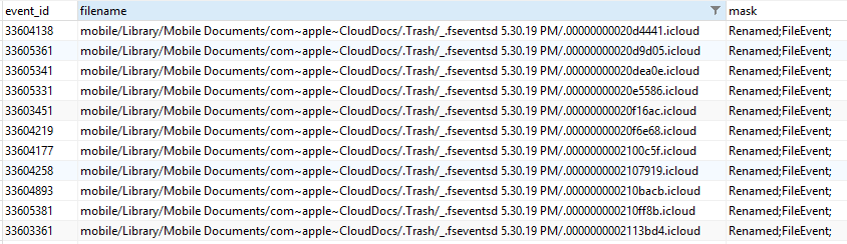

# Apple FSEvents Forensics——苹果深层文件系统
没有相关文档、未经探索、利用不足，这就是 FSEvents 目前的状况。Apple FSEvents 或者说深层文件系统对于每个苹果审查员而言都是非常宝贵的证物，它是一个很好的资源，这个证物与文件系统之前发生了什么变化有关。在这篇文章中，我将对存储在磁盘中的 FSEvents 日志做简要概述，包括 FSEvents 的背景知识和行为。本文主要基于 OS X，但也涉及到 iOS。

本文讨论的主题包括：

* FSEvents 简介
* FSEvent 日志位置
* FSEvent 记录结构
* FSEvents 行为
* 解析 FSEvents
* 有趣的纪录
* 关于FSEvents 的警告

## 介绍
在OS X 中，FSEvents 记录了卷上的文件系统对象（比如文件或文件夹）发生的更改事件。它被TimeMachine 和 Splotlight 等操作系统的多个组件使用。  

OS X 10.5和10.6仅捕获与文件夹相关的事件， 从OS X 10.7开始引入文件事件。 类似于Windows系统的NTFS更改日志（该日志记录一直文件系统活动，并将数据存储在UsnJrnl:$J中），FSEvents也一直记录文件系统，并将数据存储在FSEvent日志文件中。  

通过解析FSEvent日志，过去发生的文件系统事件，如文件、文件夹、符号链接和硬链接的创建、删除、重命名、修改、权限更改等都可以被审查，给审查员提供另一个绝好的资源用于法庭调查。  
 
记录在日志中可能对调查有价值的信息包括：安装和卸载外部驱动器和磁盘映像、用户配置文件目录中的活动、文档编辑、互联网活动、移动到垃圾篓的文件，下载的文件等等。

## FSEvent日志位置

### 在OS X中的位置
在OS X上，FSEvent日志位于系统分区根目录中名为“.fseventsd /”的隐藏文件夹中。 请注意，默认情况下，该文件夹在正在运行的Mac上的Finder中被隐藏，并且访问它需要提升权限。

### 在iOS中的位置
对于iOS设备，存在多个存储FSEvent日志的位置。 请注意，通常需要越狱设备来拉取FSEvent日志。 FSEvent日志位置包括：

1）系统：/.fseventsd

2）数据：/private/var/.fseventsd

* 设备首次被用户使用后的用法。

3）开发人员补丁：/DeveloperPatch/.fseventsd
	
* 包含用户首次使用设备之前的记录。 如果操作系统在购买后被修补，这可能还包括修补程序活动，但尚未验证。

### 外部设备位置
对于插入Mac的外部设备，如果它们存在，它们将位于设备根文件夹中的“.fseventsd /”目录中。 然而，有几种情况会导致外部设备具有“.fseventsd /”文件夹，但文件夹中没有日志：

a.外部设备已插入Mac，但设备没有安全移除，导致FSEvent日志丢失。 例如，用户从Mac中拔出usb驱动器，而不使用Finder中的卸载图标。

b.将外部设备插入Mac，设备被安全删除（已卸载），但是在操作系统在完成将FSEvent写入磁盘之前，设备已拔下电源。

c.外部设备已插入Mac，但与设备存在未知的文件系统兼容性问题。

## FSEvent日志文件

'.fseventsd /'目录可以包含一个、几个甚至数百个文件日志，每个日志文件包含几天到几个月的历史文件系统和用户的活动。

单个日志文件可以记录很多天的信息，但是具体要取决于卷上发生的活动数量。系统更新、升级和应用程序安装往往会生成大量的FSEvent。

日志是gzip存档，并使用十六进制格式表示的特定命名标准命名。 每个FSEvent日志的名称引用存储在FSevent日志文件中的最后一个事件ID加1。

例如，下图中列出的FSEvent日志的第一个，当文件名从十进制值“00000000000a4b3e”转换为十进制时，该值为674,622。 因此，此文件中的最后一个事件ID为674,621，比674,622小1。

### FSEvent记录的生命周期
FSEvent记录最初存储在内存中。当卷上的对象发生更改时，FSEvents API将检查对象是否已经使用对象的相对完整路径分配了事件ID。FSEvent记录的组件（包括事件ID在内）将在后面进行更详细的讨论。如果没有为内存中的对象分配事件ID，则会分配一个事件ID，并将对象的相对完整路径、记录标志和事件ID存储在内存中。如果对象已经被分配了一个事件ID，API将更新记录标志以包括当前的更改。对于对象在内存中分配事件ID之后的每次更改，API会将之（记录标志）合并并将其存储为对象的单个事件。

当FSEvents API确定内存缓冲区已满或已卸载卷时，会以FSEvent日志文件的形式将事件刷新到磁盘。一旦刷新到磁盘，API将不会修改日志的内容。

如前所述，可以在单个FSEvent记录中记录多个更改，每条记录都表示了对象发生什么样的更改。 例如，如果创建了用户桌面上的文本文件，然后修改，五分钟后再次修改，然后最终移除（删除），这两个修改只会作为单个事件记录一次。 解析文本文件的事件记录可能如下所示：

请注意，即使上面的FSEvent记录显示了发生了哪些更改，更改的顺序也不在日志中。
这些限制并不是内容分析的锅，而是由于FSEvent API 在记录更改时所施加的粒度不足而导致的。

### FSEvent日志格式
FSEvent日志以gzip格式存储为压缩归档文件。 文件解压缩后，可以使用十六进制编辑器打开文件，以便查看原始字符串。

## FSEvent记录结构
每条FSEvent日志包含的纪录表示了卷上对象的历史更改。 FSEvent日志中的每条记录包含三个主要组成部分：

### Record Full Path
"Record Full Path"是有过更改记录的文件系统对象的唯一相对完整路径。

### Record Event IDs
根据苹果文档，事件ID["每个系统单调增加，即使是重新启动或驱动替换。 他们与任何特定的时钟或时基无关。"](https://developer.apple.com/reference/coreservices/fseventstreameventid)

文件系统对象的完整路径在每个FSEvent日志中只被分配一个事件ID。 但是它可以有多个日志，所以可以有具有多个事件ID。

### Record Event Flags
事件标志存储在每个FSEvents记录中，并包含位标志，表示：

- “Record Full Path”是（类型标志）：
	* 文件、文件夹、硬链接或符号链接
- “Record Full Path”（原因标志）发生了什么变化：
	* 创建、删除、修改、重命名、权限、Inode元数据、Finder信息、挂载或卸载
	* 其他原因标志包括：最后一个硬链接被删除，结束事务和文档修订

## 查看FSEvents的十六进制文件
下面的示例是从thumb驱动器解压缩的FSEvents日志，它包含了驱动器上发生的活动。

日志的前12个字节分配给FSEvents日志文件头，并以魔数“1SLD”开头。 一个FSEvents日志中可以有多个文件头。 每个文件头之后是事件的“Record Full Path”的开始。

在下图中，总共有三个事件，但我们只讨论第一个事件。 第一个存储的事件在偏移0x0C处具有“My_File_1.txt”的记录完整路径。

每条“Record Full Path”末尾的NULL终止符“0x00”表示它是完整路径的结尾。
完整路径的NULL终止符之后是记录的事件ID。 对于我们的示例中的第一个事件，它位于偏移0x1a。 该记录的事件ID为0x01548d或十进制的87,181。
事件ID之后是记录标志，其存储在该事件的偏移量0x22。 本文不包含对于记录标志解码的详细叙述，但是对于该事件，0x5505800的十六进制值表示这是已经被创建、修改、Finder信息被改变并且inode元数据被改变的文件。

## FSEvent记录标志
在下表中涵盖了有关每个合理的标志的信息，表格中包括但不限于设置该标志的一些场景。

| 记录标志 | 名称 | 描述 | 可能的场景 |
|---------|-----|------|----------|
|0x00000001|对象是文件夹|事件报告中的路径指向一个文件夹||
|0x00000002|挂载|一个卷被挂载在事件报告描述的路径中|- 已连接网络驱动器或共享 - 已插入可移动驱动器  - 双击DMG文件 - 终端中使用了mount命令 - 系统启动时内部卷挂载|
|0x00000004|卸载|在事件报告描述的路径，一个卷被卸载|- 已断开连接网络驱动器或共享 - 已卸载可移动驱动器  - DMG文件被卸载 - 终端中使用了unmount命令 - 系统关闭或重新启动时已挂载的卷被卸载|
|0x00000020|事务结束|已卸载卷，并指示挂载的事务结束||
|0x00000800|删除最后一个硬链接|事件中报告的路径是最后一个硬链接，它已被删除||
|0x00001000|对象是一个硬链接|事件报告中描述的路径指向一个硬链接|- 使用终端命令ln|
|0x00004000|对象是个软链接|事件报告中描述的路径指向一个软链接|- 使用终端命令ln -s|
|0x00008000|对象是个文件|事件报告中描述的路径指向一个文件||
|0x00010000|权限更改|事件报告中描述的路径的权限已更改|- 使用终端命令 chmod 或 chown - 通过按住ctrl键单击一个对象并选择“Get Info“来修改所有权信息|
|0x00020000|扩展属性修改|事件报告中描述的路径的扩展属性已修改|- 使用终端命令xattr - 在Finder中修改对象的标签 - 更改用于打开文件的默认应用程序|
|0x00040000|扩展属性移除|实践报告中描述的路径的扩展属性已移除|- 使用终端命令 xattr -d|
|0x00100000|文档修订已更改|文件的文档修订已更改|- 启用修订版本的文档被更改时|
|0x01000000|创建|在事件报告中描述的路径创建了一个文件。注意这个纪录标志只用于文件，不用于文件夹|- 将文件从一个挂载的卷复制到另一个挂载的卷 - 使用终端命令touch - 使用文件复制和粘贴
|
|0x02000000|移除|在事件报告中描述的路径一个文件或文件夹被移除。这个记录标志可被设置于文件或文件夹|- 从一个已挂载的卷中移动文件到另外一个卷 - 清空垃圾篓 - 使用终端命令rm|
|0x04000000|索引节点元数据修改|在事件报告中描述的路径的索引节点元数据已修改|- 文件或文件夹被锁定或解锁|
|0x08000000|重命名|在事件报告中描述的路径的对象被重命名。注意，重命名意味着对象被更改名称或它被移动到了别的文件夹下|- 重命名一个文件或文件夹 - 在同一个卷中移动文件或文件夹 - 使用终端命令 ren 重命名文件或文件夹 - 使用终端命令 mv 在同一个卷中移动文件或文件夹|
|0x10000000|内容修改|文件的内容被修改|- 编辑文件的内容  - 修改用于打开文件的默认应用程序|
|0x20000000|交换|两文件的内容交换|- 文档被编辑然后保存，该文档的临时文件与正在保存的文档共享信息|
|0x40000000|Finder 信息修改|Finder信息被修改|- stationary pad选项已修改  - Tags已更改|
|0x80000000|文件夹创建|在事件报告中描述的路径创建了一个文件夹|- 使用终端命令mkdir - 使用文件夹的粘贴和复制|

## 解析FSEvents

可以使用付费或开源工具来解析FSEvents。

BlackBag Technologies BlackLight截至2016年R1支持解析FSEvents，as seen on The Forensic Lunch 2/26/201。

FSEventParser是由G-C Partners开发的一款免费开源的基于Python的工具，它也可以解析FSEvents。可以在GitHub上下载最新版本，网址为：[https://github.com/dlcowen/FSEventsParser](https://github.com/dlcowen/FSEventsParser)。

从要分析的卷中提取FSEvent日志之后，GitHub页面上提供了命令行选项的说明。您还可以使用您选择的数据恢复工具雕刻gzip文件，并解析它们。

---
用法：FSEParser_v2.1.py -c CASENAME -s SOURCEDIR -o OUTDIR

选项：*

-h，-help 显示帮助消息并退出

-c CASENAME 当前会话的名称，用于命名标准

-s SOURCEDIR 包含要解析的fsevent文件的源目录

-o OUTDIR 用于存储解析的报告的目标目录

一旦发出命令，解析器将提取位于命令提供的SOURCEDIR中的每个FSEvent日志文件中的记录，将解析的数据放入一个制表符分隔的tsv文件和OUTDIR中的SQLite数据库。

## FSEventsParser 的输出
解析器完成解析后，可以使用Excel打开制表符分隔文件。 FSEvent记录了完整路径（下面的截图中的文件名列）并以字母顺序存储在日志中。 要在解析输出中实现时间顺序的排序，请按“event_id”列排序升序。 但是请记住，时间顺序仅与对象发生第一次更改的时间相关。

FSEventsParser脚本还生成一个包含解析记录的SQLite数据库，这对于分析的记录可能超过100万条的时候很有用。如果你想查看感兴趣的纪录，可以运行查询以缩小纪录范围，这时SQLite数据库也能派上用场。
## OS X中有趣的事件
这里所有讨论的事件都是使用G-C Partners的FSEventParser工具进行解析的，该工具将事件输出到SQLite数据库。 这里列出的事件只会浅显的涉及FSEvents日志中的内容。 本节提供给您一个概念：在这些日志中可以找到什么东西？  解释如何生成这些事件的确切原因需要额外的测试和验证。

### 垃圾篓的活动
FSEvents日志文件记录垃圾篓活动，其中包括发送到垃圾篓和垃圾篓的清空。 发送到垃圾篓的文件将包含“重命名”掩码。 从“垃圾篓”中清空的文件将包含“已删除”掩码。

下图显示了发送到垃圾篓的文件和文件夹。 请注意，在“掩码”列中，所有事件都包括“重命名”。 请注意，“重命名”的说法有点用词不当。 “重命名”掩码以两种方式分配给事件：

1. 文件的名称已更改。
2. 该文件从一个文件夹移动到另一个文件夹（仅本地移动，不能跨卷移动）。

对于垃圾篓中的文件夹，当文件发送到垃圾篓时，他们会收到一个“重命名”掩码，因为它们已从卷上某个其他位置移动到垃圾篓。

### SQLite查询示例

SELECT 
*, \_ROWID\_ “NAVICAT_ROWID” 
FROM 
“fsevents” 
WHERE 
“filename” LIKE ‘Users/%/.Trash/%’ 

### 系统引导
系统启动时，OS将挂载“/home”和“/net”。 我们可以查询SQLite数据库以获取系统引导的大致日期的列表。 在下图中，只查询了“/home”。

### SQLite查询示例
SELECT 
*, \_ROWID\_ “NAVICAT_ROWID” 
FROM 
“fsevents” 
WHERE 
( 
“filename” = ‘/home’ 
OR “filename” = ‘/net’ 
) 
AND “mask” LIKE ‘%mount%’ 

### 用户个人资料文件夹
用户个人资料中的活动也可能特别令人感兴趣。这可能包括文档、下载和桌面活动。 在下面的图片中，一个文件夹被重命名，并在桌面上创建了两个DMG， 在下载目录中，创建了一个ZIP文件。

请注意，这些文件的一些创建是由用户（我）发起的，有些是由应用程序或操作系统创建的。 在下载目录中，.BAH.XSEHo 、.DS_Store 和 M9hlK5RI.zip.part 不是由我直接创建的。

### SQLite查询示例
SELECT 
*, \_ROWID\_ “NAVICAT_ROWID” 
FROM 
“fsevents” 
WHERE 
( 
“filename” LIKE ‘Users/%/Documents/%’ 
OR “filename” LIKE ‘Users/%/Downloads/%’ 
OR “filename” LIKE ‘Users/%/Desktop/%’ 
) 
AND “filename” NOT LIKE ‘Users/%/Library/Caches/com.%’ 
AND “filename” NOT LIKE ‘Users/%/Library/Containers/com.%’ 
AND “filename” NOT LIKE ‘Users/%/Documents/Microsoft User Data/Office %’ 
### 挂载的卷
当驱动器插入时，操作系统将尝试安装它。 当双击DMG时，操作系统也将尝试安装它。 挂载也记录在FSEvents中。

### SQLite查询示例
SELECT 
*, \_ROWID\_ “NAVICAT_ROWID” 
FROM 
“fsevents” 
WHERE 
“mask” LIKE ‘%mount%’ 
AND “filename” NOT LIKE ‘/net’ 
AND “filename” NOT LIKE ‘/home’ 

### 互联网活动
诸如Safari和Chrome之类的网络浏览器使用与互联网活动相关联的文件的名称存储网站地址或URL。 这些文件的更改记录在FSEvents中。 下面图片中列出的大多数网站是我直接访问该网站的结果，其他网站似乎来自第三方网站，并没有直接访问。

### SQLite查询示例
SELECT 
*, \_ROWID\_ “NAVICAT_ROWID” 
FROM 
“fsevents” 
WHERE 
“filename” LIKE ‘Users/%/Library/Caches/Metadata/Safari/History/%’ 
OR “filename” LIKE ‘Users/%/Library/Application Support/Google/Chrome/Default/Local Storage/%’ 
OR “filename” LIKE ‘Users/%/Library/Safari/LocalStorage/%’ 

### iCloud同步文件
从连接的iCloud帐户同步的文件由FSEvents记录。

### SQLite查询示例
SELECT 
*, \_ROWID\_ “NAVICAT_ROWID” 
FROM 
“fsevents” 
WHERE 
“filename” LIKE ‘%websitedata/local%’ 

### 邮件活动
邮件活动包括收到的项目（收件箱），发送的项目和相关的附件名称也由FSEvents记录。

### SQLite查询示例
SELECT 
*, \_ROWID\_ “NAVICAT_ROWID” 
FROM 
“fsevents” 
WHERE 
“filename” LIKE ‘mobile/Library/Mail/%’ 

## 注意事项

像任何取证工具一样，有一些必须熟悉的注意事项。 对于FSEvents，这些包括：

* 丢失FSEvents
* 缺少时间戳
* 外部设备和FSEvents波动
* 反取证
* 合并多项变更

### 丢失FSEvent日志
有几种情况会导致FSEvent日志丢失或从卷中移除（删除）。 这可能包括：

* 系统的硬复位
* 系统崩溃
* 未正确卸载卷
* 系统升级
在OS X上，当从卷中删除FSEvent日志时，它们将会变成未分配的状态。 因此，可以使用数据恢复技术和雕刻工具雕刻gzip文件来雕刻FSEvent日志。

### 缺少时间戳
如前所述，FSEvent记录由三个部分组成：完整路径，记录标志和事件ID。 请注意，时间戳不是三部分之一。

有办法克服这个问题，但到目前为止，没有人能给你事件发生的精确时间戳。从苹果系统日志文件的名称中提取时间数据，并且可能会在FSEvent日志中记录其他文件的名称，以帮助确定事件发生的大致时间。
### 外部设备
外部设备上的FSEvent可能特别不稳定。

* 当进行安全删除时，操作系统将FSEvent记录写入设备。这可以通过观察装配在一些可移动设备上的读/写指示灯来观察。在OS中启动安全删除后，指示灯将闪烁，并在完成后停止。如果在指示灯停止闪烁之前驱动器已拔下，则操作系统可能尚未完成写入，并且这些FSEvent记录可能会丢失并且无法恢复。
* 当驱动器已拔下但用户未执行安全删除时，存储在设备内存中的FSEvent将丢失，不会写入驱动器。
* 还观察到，如果驱动器使用EXFAT或FAT32格式化，则使用安全删除并不总是能确保将事件写入了磁盘。确切的原因尚未确定，但是对于非hfs格式化的可移动设备，一直有FSEvent丢失的事件发生。

### 合并多项变更
FSEvent记录标志可以指示文件或文件夹发生多次更改。由于FSEvents API记录和存储变化的工作原理的特性，确定每个单独变化发生的顺序以及发生这些更改的次数所需的粒度是无法满足的。

使用FSEvents我们顶多只能确定对象的第一次更改发生的时间顺序。

首先有一个坏消息，这里存在一个很严重的问题。请记住，FSEvents主要基于文件系统对象的相对完整路径存储更改事件。所以，比如说我在桌面上创建了一个名为“example.zip”的文件，在短时间内，该文件不论以任何方式被删除，然后再次创建具有完全相同名称和路径的另一个文件。现在我的桌面上有一个完全不同的文件， 但是 FSEvents API将它们看作是同一个文件，因为它仅在记录更改时考虑相对完整路径。所以即使“example.zip”创建了两次，是两个完全不同的文件，它只记录一次（请记住，这是在短时间内发生的）。

还有一个好消息是，FSEvents确实记录了一个文件/文件夹被更改的事实，我们知道发生了什么样的更改，只是不是顺序和频率。