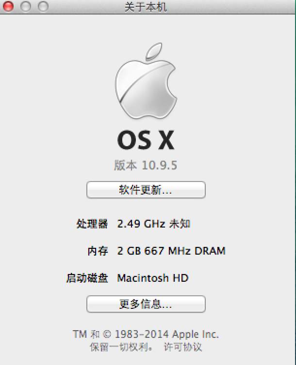
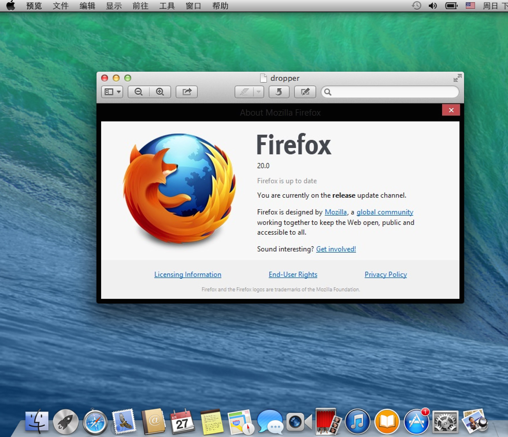
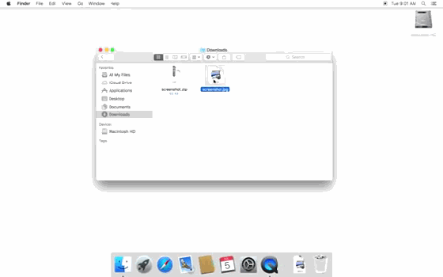
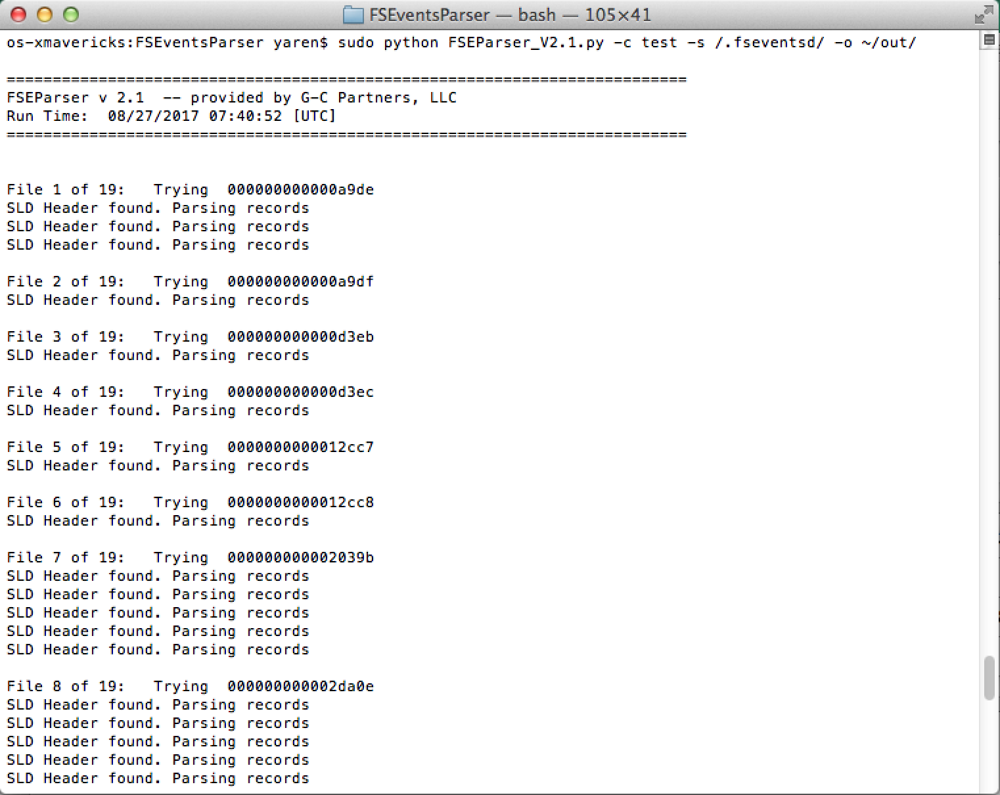
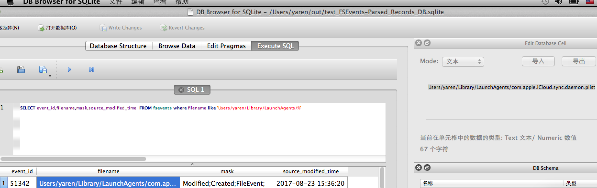
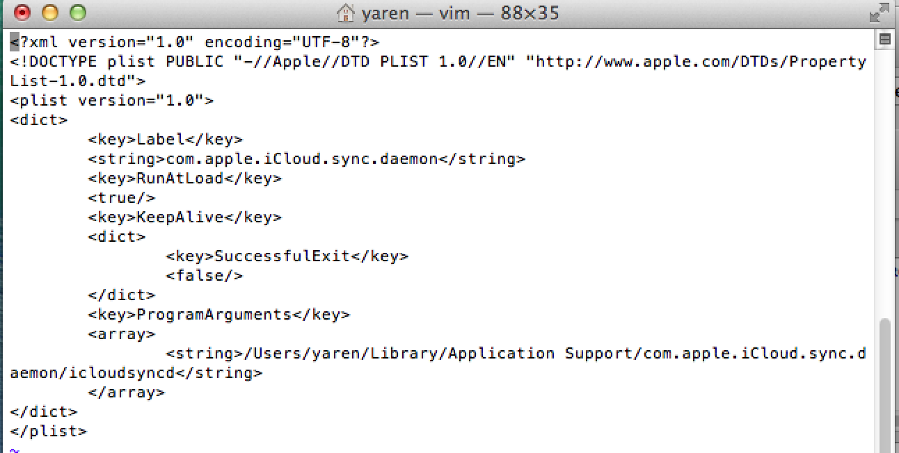
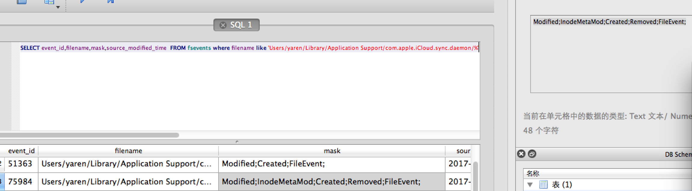
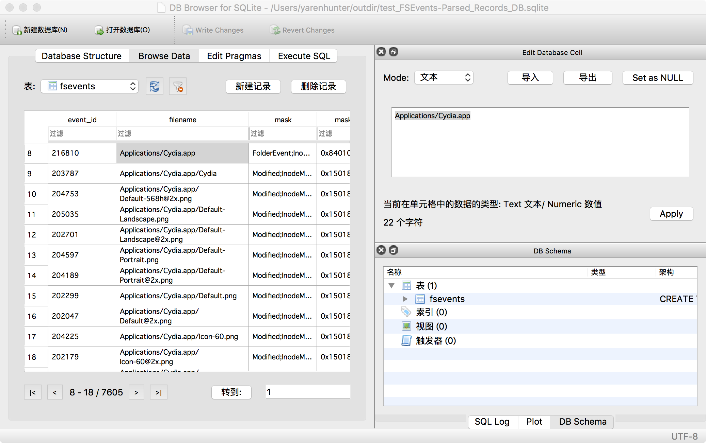

## 在OS X中的实验

本次实验使用PD虚拟机，系统版本如下：

本次使用的木马样本为[OSX/Keydnap](http://www.freebuf.com/articles/system/108732.html)。

### 执行样本
在虚拟机中双击执行木马样本，执行结果如下：

.

其实木马已经在Terminal执行，完整的动图如下,注意在打开预览前文件图标瞬间的变化：

### 取证分析

恶意软件运行以后，如果具备root权限, 考虑自身持续性，会在

`/Library/LaunchAgents/`

或

`/$USER/Library/LaunchAgents/`

目录下安装一个plist文件。所以我们可以从这两个文件夹下手，使用FSEvents进行检测。

在命令行执行：

`mkdir ~/out`

`sudo python FSEParser_V2.1.py -c test -s /.fseventsd/ -o ~/out/`

执行完毕后进入～/out文件夹有三个文件，使用 DB Browser for SQLite 打开sqlite文件并查询：

我们发现在该目录下的可疑文件`com.apple.iCloud.sync.daemon.plist`

使用vim编辑器打开该文件：

通过该文件我们找到了它的执行文件的位置：

`/Users/yaren/Library/Application Support/com.apple.iCloud.sync.daemon/icloudsyncd`

查看可执行文件的FSEvents纪录：

由于笔者多次执行了该样本，所以之前的文件被移除，并再次创建，但是由于文件路径一样，被视为同一个文件，分配同一个事件id，所以有`Removed`的事件标志，其实这个文件依然存在。

同一路径下的，还有纪录进程ID的文件`process.id`。

### 结论
1. 通过FSEvents可以查看所有文件的操作信息，即使文件被移除/删除，也会在纪录中留下痕迹，是取证分析的有力助手。
2. 文件做多次同类型变更时，只会纪录一次。
3. 非同类型变更合并时，纪录是无序排列的。
4. 无法从FSEvents得知每一次变更的具体时间。

## 在ios中的实验
对于iOS设备，存在多个存储FSEvent日志的位置。 请注意，通常需要越狱设备来拉取FSEvent日志。 

通过ssh链接到越狱设备中，将 `./fseventsd` 文件夹拷贝到mac中。

使用FSEventsParser解析后，如下，

### 结论
1. FSEvents也会在iOS设备中使用。
2. iOS日志位置有两处：

`/.fseventsd`

`/private/var/.fseventsd`

### 下载 
* 木马样本： https://t.co/Tu9WYYLGaQ  解压密码：infect3d
* 解析工具下载： https://github.com/dlcowen/FSEventsParser

