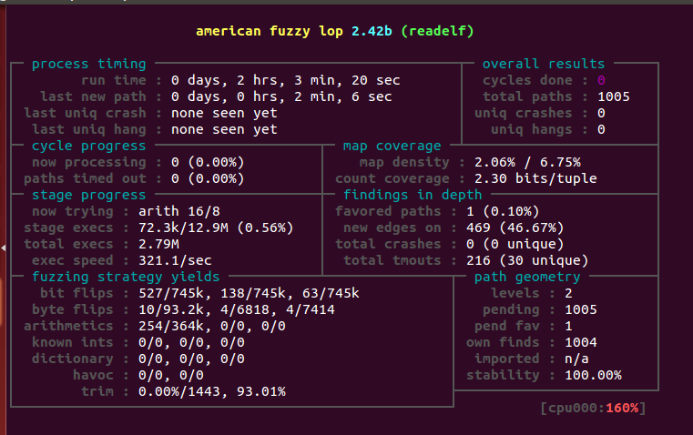

# 辰 Team    翻译-用Fuzz使iOS App更加健壮和安全
> 参照“Make iOS App more Robust and Security through Fuzzing”   完成Fuzz 在IOS上 应用--翻译AFL的原理，应用 经典文章。

## plan

* week 1 6月5日 - 6月11日 熟悉AFL源码，搜集AFL的经典应用。完成Porting ，对比iOS 与Android。

* week 2 6月12日 - 6月18日  完成AFL iOS 对应的sample 。对比典型的Fuzz。

* week 3 6月19日 - 6月25日  输出实验 与翻译的文档。

## 完成 由于时间有限，完成部分，后面有时间 逐渐添加PPT中的实验

* Unix 完成 AFL的编译 与验证。

* AFL-ios 移植与实验

* AFL-ios 其他实验步骤（后续补充）