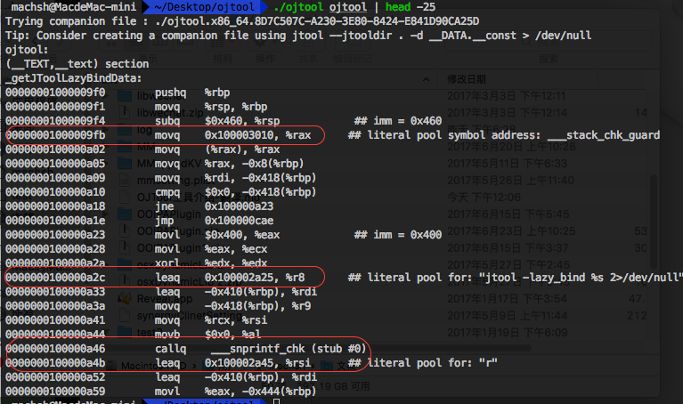

# 准备
1. 拷贝ojtool[源码](http://newosxbook.com/src.jl?tree=listings&file=otoolfilt.c)到ojtool.c，直接用```gcc -o ojtool ojtool.c```命令编译源码。
2. 下载[jtool](http://www.newosxbook.com/index.php?page=downloads),下载完后解压将jtool拷到/usr/local/bin/下。
3. otool(mac系统应该都有吧，没有的自己网上下个放到/usr/bin下)

# 例子



