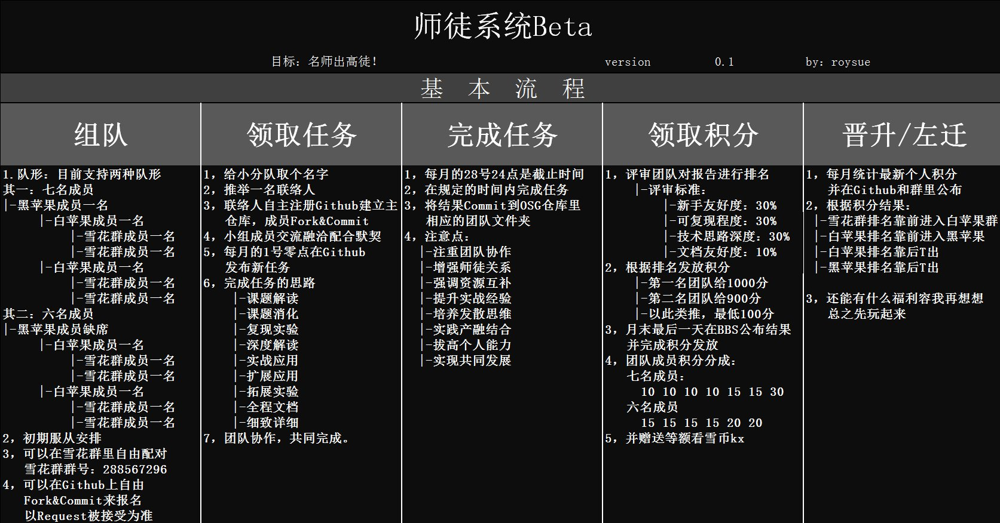

I# RANKINGS

|BLACK|POINT|WHITE|POINT|KANXUE|POINT|
|:--:|:--:|:--:|:--:|:--:|:--:|
|黑苹果群|积分|白苹果群|积分|雪花群|积分|
|afox|300|凌迟|175|物以类聚|300|
|rainyx|200|小学生|175|黑煤炭|200|
|布兜儿|135|黄大先生|150|紫枫闲人|200|
|B1nGzl|100|HSHtime|150|aliceforever|200|
|||AloneMonkey|135|cosmosdzh|200|
|||七步阶|100|XGalaxy|200|
|||||chen|180|
|||||madmark|180|
|||||星期五|150|
|||||asel|150|
|||||lostkid-hz|150|

.
.
.

------

# TOPICS OF AUGUST

|LEVEL|TOPIC|ATTACHMENT|DEADLINE|
|:--|--|--|:--|
|★|【Code Review】Tweak开发：espring之后弹自定义消息|[PopUpOnStart](https://github.com/LacertosusRepo/Open-Source-Tweaks)|23:59 of 28th,August|
|★|【非越狱调试】Frida的基本功能 |[Cross-platform reversing with Frida](http://2015.zeronights.org/assets/files/23-Ravnas.pdf)|23:59 of 28th,August|
|★|【Code Review】Tweak开发：给调音量增加震动反馈|[Volbrate](https://github.com/LacertosusRepo/Open-Source-Tweaks)|23:59 of 28th,August|
|★★|【非越狱调试】通过案例入门Frida|[frida-learn-by-example](http://www.ninoishere.com/frida-learn-by-example/)|23:59 of 28th,August|
|★★|【Code Review】Tweak开发：每次respring之后给你播放一段音乐|[SoundSpring](https://github.com/LacertosusRepo/Open-Source-Tweaks)|23:59 of 28th,August|
|★★|【非越狱调试】逆向iOS过程中一些有用的Frida脚本|[some useful frida script for iOS Reversing](https://github.com/as0ler/frida-scripts)|23:59 of 28th,August|
|★★★|苹果FSEvent深层文件系统调用记录方法论|[Apple FSEvents Forensics](http://nicoleibrahim.com/apple-fsevents-forensics/)|23:59 of 28th,August|
|★★★|MacRansom,Mac上的勒索软件分析（带过反调试、反虚拟机）|[OSX/MacRansom:analyzing the latest ransomware to target macs](https://objective-see.com/blog/blog_0x1E.html)|23:59 of 28th,August|
|★★★|iOS软件安全全局方法论| [iOS Application Security Review Methodology](http://research.aurainfosec.io/ios-application-security-review-methodology/)|23:59 of 28th,August|
|★★★★|Project Zero 研究员 Felix总结的iOS安全开发方法论| [Secure iOS application development](https://github.com/felixgr/secure-ios-app-dev)|23:59 of 28th,August|

>[TopicHistory](TopicHistory.md)

>文档越好、动手越多、难度越大，分数越高；反之文档不友好、动手很粗糙、难度入门级，分数越低。

***

# TEAMS

**交流群：288567296**

|TEAMS|CONTACTER|LEADER|MEMBERS|MONTHLY TOPIC|
|:-:|:-|:-|:-|:-|
|甲| gezihuzi| B1nGzl|B1nGzl、星期五、HSHtime、今天星期六吧、myhloli、iOSSecret|如何在 macOS 中监控指定应用的 HTTPS 流量	|
|乙|dunwin |song |song、dunwin、parker1014、长昵称、顾何、前方的路、easthg|not yet|
|丙|liuswear| 布兜儿|布兜儿、AloneMonkey、liuswear、madmark、kiba、chen、xuaninitial| 实验code review 解码苹果上所有的Tokens decrypts/extracts all authorization tokens on macOS/OSX |
|丁|	 ||| not yet  |
|戊| 爱心觉罗|三点式| 杨君、爱心觉罗、cosmosdzh、龙幽、asel、lostkid-hz、七步阶 |  基于python的开源LLDB前端GUI-Voltron简介、安装及使用 |
|己| 黑煤炭|rainyx|rainyx、拟人、超级神话、黑煤炭、ksmokee、MXXIV、紫枫闲人、| 实验-阻止iCloud 日历上的垃圾邮件邀请  |
|庚|	 | |||
|辛| 物以类聚  	 |afox| afox、物以类聚、XGalaxy、AliceForever、ctonegao、麋鹿了迷路了、yaren | joker：使用joker抽取iOS 11的kernelcache |
|壬|    	 | || |
|癸|  | | |  |
|子| | ||  |
|丑|	凌迟	|黄大先生|黄大先生、brack、凌迟、小学生、Arming、debug|APT团队海莲花出新品啦——全新设计的高级macOS后门软体套件！
|寅|		||||
|卯|		||||
|辰|||||
|巳|		||||
|午|		||||
|未|		||||
|申|		||||
|酉|		||||
|戌|		||||
|亥|		||||

***

# OSG-TEAMS
希望大家在合作中学习姿势、提升技术、交流感情。比赛第二，友谊第一。

