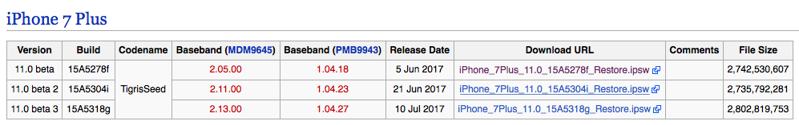
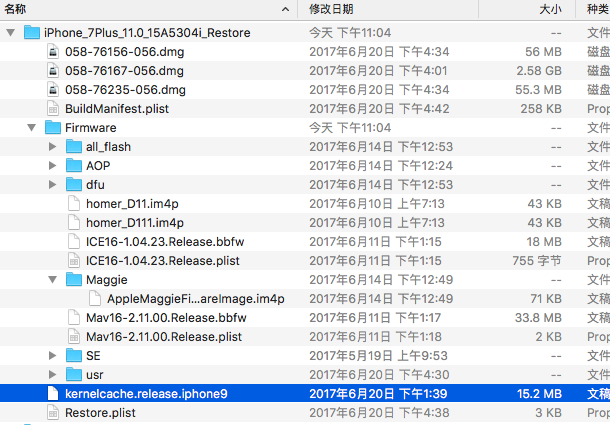

## Alice的July历险记

作为小白的我，拿到这样的title的时候，内心几乎是崩溃的，leader你要你要哪样，本姑娘还在新手村！


### 1 iOS 11镜像下载及kernelcache抽取
#### 1.1 巧妇难为无米之炊，不下载镜像怎么抽镜像呢？
想要下载镜像，当然是选择百年老店:[theiphonewiki](https://www.theiphonewiki.com/wiki/Beta_Firmware/iPhone/11.x)
本宫下载的是第二个，[iPhone_7Plus_11.0_15A5304i_Restore.ipsw](http://appldnld.apple.com/ios11.0seeds/091-19500-20170621-CA81D17E-55D4-11E7-9523-02B5C244ED54/iPhone_4.7_11.0_15A5304i_Restore.ipsw)

#### 1.2 下载下来后使用实用归档工具.app解压，乍一看里面内容还是挺多的。
kernelcache.release.iphone9是我们的初步目标。

#### 1.3 下载joker及初探
因为leader:afox想要称为偶像，我们先来完成任务，再来向下深挖。在[这里](http://newosxbook.com/tools/joker.html)的最下方下载到编译好的joker后，解压就可以直接使用了。
```terminal
$file *
joker.ELF64:     ELF 64-bit LSB executable, x86-64, version 1 (SYSV), dynamically linked, interpreter /lib64/ld-linux-x86-64.so.2, for GNU/Linux 2.6.32, BuildID[sha1]=cd3c25763e0a5a7d1ef481f03522f54e339c36b8, not stripped
joker.universal: Mach-O universal binary with 2 architectures: [x86_64: Mach-O 64-bit executable x86_64] [arm64: Mach-O 64-bit executable arm64]
joker.universal (for architecture x86_64):	Mach-O 64-bit executable x86_64
joker.universal (for architecture arm64):	Mach-O 64-bit executable arm64
```
使用file命令查看二进制文件，里面竟然包含了三种二进制结构，分别对应Linux、macOS和iPhone。由于本机是macOS，则选择joker.universal试试看。
```terminal
$./joker.universal
Usage: joker [-j] [-MmaSsKk] _filename_
 _filename_ should be a decrypted iOS kernelcache, or kernel dump. Tested on ARMv7/s 3.x-9.3, and ARM64 through 11b1

 -m: dump Mach Traps and MIG tables (NEW)
 -a: dump everything
 -k: dump kexts
 -K: kextract [kext_bundle_id_or_name_shown_in_-k|all] to JOKER_DIR or /tmp
 -S: dump sysctls
 -s: dump UNIX syscalls
 -j: Jtool compatible output (to companion file)

-dec: Decompress kernelcache to /tmp/kernel (complzss only at this stage)

Kernels not included. Get your own dump or decrypted kernel from iPhoneWiki, or Apple itself (as of iOS 10b1! Thanks, guys!)

3.999 with MACF Policies, stub symbolication, SPLIT KEXTS, Sandbox Profiles (still beta, collections only at this point) , kpp kernel zones(!). Wait for version 4.0 for IOUserClients
Compiled on Jun  5 2017

Contains code from Haruhiko Okumura (CompuServe 74050,1022) from BootX-81//bootx.tproj/sl.subproj/lzss.c
```
打印出来了帮助信息。其中：
- m是dump内核trap和消息的；
- a是dump所有能dump的东西；
- k是dump内核拓展；
- K在dump内核拓展的同时，还能把bundle_id加在上面；
- S是dump系统调用的；
- s是dump属于UNIX的系统调用的；区别在哪里，我们后文再看。
- j是jtool模式，jtool是做什么的，可以看[这里](http://www.newosxbook.com/tools/jtool.html)。

然后让我们去theiphonewiki下载内核。然后还提了下兼容IOUserClients的4.0编译版本将在Jun 5 2017放出来，现在已经July了，马上都要August了，姐下载的还是3.999版本，很明显作者Jonathan Levin食言了。

#### 1.4 抽取iOS 11的kernelcache
把kernelcache.release.iphone9拷贝到joker的文件夹里来
```terminal
$./joker.universal -a kernelcache.release.iphone9 > dump.txt
Feeding me a compressed kernelcache, eh? That's fine, now. I can decompress! (Type -dec _file_ if you want to save to file)!
Compressed Size: 15155221, Uncompressed: 30752768. Unknown (CRC?): 0xe8f143ad, Unknown 1: 0x1
Got kernel at 432
NOTE: Found an actual trap at #50, where kern_invalid was expected. Apple must have added a Mach trap!
NOTE: Found an actual trap at #95, where kern_invalid was expected. Apple must have added a Mach trap!
Got 208 kexts (yowch!)
```
抽到了208个内核拓展！yowch！
```terminal
$ head dump.txt
This is a 64-bit kernel from iOS 11.x (b1+), or later (4481.0.0.2.1)
ARM64 Exception Vector is at file offset @0xc7000 (Addr: 0xfffffff0070cb000)
mach_trap_table offset in file/memory (for patching purposes): 0xa42f0/fffffff0070a82f0
Kern invalid should be fffffff00711fc30. Ignoring those
 10 _kernelrpc_mach_vm_allocate_trap         fffffff0070ef5d8 -
 11 _kernelrpc_vm_allocate_trap              fffffff0070ef89c -
 12 _kernelrpc_mach_vm_deallocate_trap       fffffff0070ef684 -
 14 _kernelrpc_mach_vm_protect_trap          fffffff0070ef734 -
 15 _kernelrpc_vm_protect_trap               fffffff0070ef7a0 -
 16 _kernelrpc_mach_port_allocate_trap       fffffff0070ef95c -
```
赶紧跟[蒸米大神](http://weibo.com/ttarticle/p/show?id=2309404115716285534270)的比比看，是不是一样的！

用肉眼比对了一下，好像是一样的呢！曾开心！

#### 1.5 任务完成？too naive!新的旅程：ipsw孤岛大冒险！

### 2 afox成为偶像的必由之路——深入ipsw文档！
稍微来看一看ipsw里面的内容。
```terminal
$ tree -Chl
.
├── [ 53M]  058-76156-056.dmg
├── [2.4G]  058-76167-056.dmg
├── [ 53M]  058-76235-056.dmg
├── [252K]  BuildManifest.plist
├── [ 510]  Firmware
│   ├── [ 102]  AOP
│   │   └── [591K]  aopfw-t8010aop.im4p
│   ├── [ 17M]  ICE16-1.04.23.Release.bbfw
│   ├── [ 755]  ICE16-1.04.23.Release.plist
│   ├── [ 102]  Maggie
│   │   └── [ 70K]  AppleMaggieFirmwareImage.im4p
│   ├── [ 32M]  Mav16-2.11.00.Release.bbfw
│   ├── [2.2K]  Mav16-2.11.00.Release.plist
│   ├── [ 136]  SE
│   │   ├── [911K]  Icefall.RELEASE.sefw
│   │   └── [ 947]  Icefall.RELEASE.sefw.plist
│   ├── [ 816]  all_flash
│   │   ├── [144K]  DeviceTree.d111ap.im4p
│   │   ├── [ 474]  DeviceTree.d111ap.im4p.plist
│   │   ├── [143K]  DeviceTree.d11ap.im4p
│   │   ├── [ 474]  DeviceTree.d11ap.im4p.plist
│   │   ├── [407K]  LLB.d11.RELEASE.im4p
│   │   ├── [ 331]  LLB.d11.RELEASE.im4p.plist
│   │   ├── [ 13K]  applelogo@3x~iphone.im4p
│   │   ├── [ 20K]  batterycharging0@3x~iphone.im4p
│   │   ├── [ 87K]  batterycharging1@3x~iphone.im4p
│   │   ├── [182K]  batteryfull@3x~iphone.im4p
│   │   ├── [ 95K]  batterylow0@3x~iphone.im4p
│   │   ├── [3.8K]  batterylow1@3x~iphone.im4p
│   │   ├── [ 12K]  glyphplugin@1920~iphone-lightning.im4p
│   │   ├── [407K]  iBoot.d11.RELEASE.im4p
│   │   ├── [ 331]  iBoot.d11.RELEASE.im4p.plist
│   │   ├── [984K]  liquiddetect@1920~iphone-lightning.im4p
│   │   ├── [ 331]  liquiddetect@1920~iphone-lightning.im4p.plist
│   │   ├── [459K]  recoverymode@1920~iphone-lightning.im4p
│   │   ├── [4.9M]  sep-firmware.d11.RELEASE.im4p
│   │   ├── [ 474]  sep-firmware.d11.RELEASE.im4p.plist
│   │   ├── [4.9M]  sep-firmware.d111.RELEASE.im4p
│   │   └── [ 474]  sep-firmware.d111.RELEASE.im4p.plist
│   ├── [ 204]  dfu
│   │   ├── [407K]  iBEC.d11.RELEASE.im4p
│   │   ├── [ 331]  iBEC.d11.RELEASE.im4p.plist
│   │   ├── [407K]  iBSS.d11.RELEASE.im4p
│   │   └── [ 331]  iBSS.d11.RELEASE.im4p.plist
│   ├── [ 42K]  homer_D11.im4p
│   ├── [ 42K]  homer_D111.im4p
│   └── [ 102]  usr
│       └── [ 102]  local
│           └── [  68]  standalone
├── [3.2K]  Restore.plist
└── [ 14M]  kernelcache.release.iphone9

9 directories, 42 files
```
- 首先映入眼帘的最多的就是这个==im4p==文档了；
- 其次还有一些自定义的==sefw、bbfw==格式的文件稍微看一下；
- 然后问题最大的就是这个==2.4G的058-76167-056.dmg==了

#### 2.1 揭秘im4p
##### 2.1.1 初探
使用file查看文档格式，显示是data，数据。
```terminal
$ file ./Firmware/all_flash/batterylow1@3x~iphone.im4p
./Firmware/all_flash/batterylow1@3x~iphone.im4p: data
```
查看对应的plist属性信息。
```terminal
$ plutil -p Firmware/all_flash/DeviceTree.d111ap.im4p.plist
{
  "rdtr" => {
    "Digest" => <ac47602b a18f442b e8ac1937 80896118 c0901792 1d8b0b90 c247751a cb2a1fb7 ca2e0b91 fe2d0442 63a81c46 e5f11443>
  }
  "dtre" => {
    "Digest" => <00a21d35 1b4ab135 1b67d4b9 dccea66a db5f1955 5462f46d 84330937 edb0c43c fc0e904b 50e8d4d2 81c5ee25 fd11eb2c>
  }
}
$ plutil -p Firmware/all_flash/LLB.d11.RELEASE.im4p.plist
{
  "illb" => {
    "Digest" => <45b84526 f060f6fa 6673b838 cc932b82 8210b8ff 313f7a49 794f1765 ea8f4a8b 420a3d57 4b14cbc4 83616023 95f404ea>
  }
}
```
好像没有发现特别有意思的内容，貌似看上去是个摘要，确保文件不被更改。

继续搜索im4p，在百年老店theiphonewiki找到[答案](https://www.theiphonewiki.com/wiki/IMG4_File_Format)，重定向至IMG4文件格式。
>The IMG4 file format is a replacement for the IMG3 file format and is used on devices running a 64-bit processor (A7 or newer) and the Apple Watch series. Just like the old IMG3 file format, it is used to contain files used by iOS' secure boot chain (im4p files), signatures of those files (ApImg4Ticket) and likely some info used in the Restore Process ("IM4R" can be found in MobileDevice framework). The only known place in iOS filesystem where a complete IMG4 file can be found is /usr/standalone/firmware/sep-firmware.img4. Extracting a PersonalizedBundle from /tmp during a restore will also yield complete IMG4 files. The embeddedOS images in the macOS filesystem for the 2016 MacBook Pros also have complete IMG4 files.

IMG4是IMG3的升级版本，用在64位的A7及以后的处理器上，AppleWatch也是用的这个。该文件里面的内容包含了：
- iOS安全启动链Secure Boot Chain所需文件；
- 相对应的签名；
- 恢复过程中的一些流程文件（可以在MobileDevice框架里找到IM4R）。

##### 2.1.2 结构信息和内容解密
>Contrary to the IMG3 file format where a custom binary format was used, IMG4 files (and their payloads) are DER encoded ASN.1 objects. The reason for Apple's choice of ASN.1/DER encoding over their own Property List (PList) file format is currently unknown.
```terminal
sequence [
   0: string "IMG4"
   1: payload   - IMG4 Payload, IM4P
   2: [0] (constructed) [
          manifest   - IMG4 Manifest, IM4M
      ]
]```

IMG3用的是自定义的格式，IMG4使用的却是DER加密的ASN.1对象，为啥苹果改了主意，谁也不知道。格式信息如上。包含payload也就是内容，manifestst。

稍微head看了一下内容，完全无法阅读。
```terminal
$ head Firmware/all_flash/DeviceTree.d111ap.im4p
0�>?IM4PdtreEmbeddedDeviceTrees-3419�>target-typeD111mlb-serial-number�syscfg/MLB#/0x20,zeroes/0x20compatibleD111APiPhone9,4AppleARMsecure-root-prefixmdAAPL,phandleplatform-name device_typbootromregion-info�syscfg/Regn/0x20,zeroes/0x20regulatory-model-number�syscfg/RMd#/0x20model-number�syscfg/Mod#/0x20,zeroes/0x20#address-cells#size-cellsserial-number�syscfg/SrNm/0x20,zeroes/0x20clock-frequencymanufacturer
                                                                                                                                            Apple Inc.model
iPhone9,4config-number�syscfg/CFG#/0x20,zeroes/0x20name
                                                       device-tree0crypto-hash-method	sha2-384housing-color
                                                                                                             �syscfg/CLHSunique-chip-iboard-iddie-igid-aes-keyproduction-certmac-address-wifi0�macaddr/wifiaddr,syscfg/WMac/6dram-vendormix-n-match-prevention-statusdisplay-scalesoftware-bundle-version�syscfg/SBVr/0x10,zeroes/0x10certificate-production-statusboot-manifest-hash0effective-production-status-sepboot-noncnvram-proxy-data uid-aes-keybootp-response,image4-supportedAAPL,phandledevelopment-certnamechosenenclosure-material
                                                                                                                                                                                                                                                                   �syscfg/EnMtroot-matchingmarketing-hardware-behavior
                                         �syscfg/MkBHmac-address-ethernet0�macaddr/ethaddr,syscfg/EMac/6dram-vendor-idcoverglass-color
                                                                                                                                      �syscfg/CLCGfirmware-versionsecure-bootsoftware-behavior�syscfg/SwBh/0x10,zeroes/0x10backing-color
                                                                                                                                                                                                                                        �syscfg/CLBGcertificate-security-modeconsistent-debug-rooeffective-security-mode-apeffective-security-mode-seprandom-seed@system-trustedbacking-glass-material
                                                                                                                        �syscfg/BGMtchip-idcover-glass-material
                                                                                                                                                               �syscfg/CGMtmac-address-bluetooth0�macaddr/btaddr,syscfg/BMac/6debug-enableddisplay-rotation#address-cellsmarketing-software-behavior
                      �syscfg/MkBSeffective-production-status-ap4UnusedIntegerProperty1UnusedBooleanProperty3UnusedIntegerPropertyUnusedBooleanProperty18UnusedBooleanProperty11UnusedIntegerProperty1UnusedIntegerPropertyUnusedBooleanProperty6UnusedIntegerPropertyUnusedStringProperty2@UnusedBooleanProperty16UnusedStringProperty5@UnusedIntegerProperty1UnusedBooleanProperty2UnusedIntegerPropertyUnusedBooleanProperty9UnusedStringProperty8@UnusedBooleanProperty14UnusedIntegerProperty1UnusedIntegerPropertyUnusedIntegerProperty1UnusedBooleanProperty5UnusedIntegerPropertyUnusedStringProperty0@UnusedBooleanProperty19AAPL,phandleUnusedBooleanProperty12UnusedIntegerProperty1UnusedStringProperty3@UnusedBooleanProperty1UnusedIntegerPropertyUnusedBooleanProperty8namemanifest-propertiesUnusedStringProperty6@UnusedBooleanProperty17UnusedBooleanProperty10UnusedIntegerPropertyUnusedIntegerProperty1UnusedBooleanProperty4UnusedIntegerPropertyUnusedStringProperty9@UnusedBooleanProperty15UnusedIntegerProperty1UnusedStringProperty1@UnusedIntegerProperty1UnusedBooleanProperty0UnusedBooleanProperty7UnusedIntegerPropertyUnusedStringProperty4@UnusedBooleanProperty13UnusedIntegerProperty1UnusedStringProperty7@4UnusedIntegerProperty1UnusedBooleanProperty3UnusedIntegerPropertyUnusedBooleanProperty18UnusedBooleanProperty11UnusedIntegerProperty1UnusedIntegerPropertyUnusedBooleanProperty6UnusedIntegerPropertyUnusedStringProperty2@UnusedBooleanProperty16UnusedStringProperty5@UnusedIntegerProperty1UnusedBooleanProperty2UnusedIntegerPropertyUnusedBooleanProperty9UnusedStringProperty8@UnusedBooleanProperty14UnusedIntegerPropertyUnusedIntegerPropertyUnusedIntegerProperty1UnusedBooleanProperty5UnusedIntegerPropertyUnusedStringProperty0@UnusedBooleanProperty19AAPL,phandleUnusedBooleanProperty12UnusedIntegerProperty1UnusedStringProperty3@UnusedBooleanProperty1UnusedIntegerPropertyUnusedBooleanProperty8namemanifest-object-propertiesUnusedStringProperty6@UnusedBooleanProperty17UnusedBooleanProperty10UnusedIntegerPropertyUnusedIntegerProperty1UnusedBooleanProperty4UnusedIntegerPropertyUnusedStringProperty9@UnusedBooleanProperty15UnusedIntegerProperty1UnusedStringProperty1@UnusedIntegerProperty1UnusedBooleanProperty0UnusedBooleanProperty7UnusedIntegerPropertyUnusedStringProperty4@UnusedBooleanProperty13UnusedIntegerProperty1UnusedStringProperty7@MemoryMapReserved-14MemoryMapReserved-5MemoryMapReserved-11MemoryMapReserved-0MemoryMapReserved-6AAPL,phandleMemoryMapReserved-15MemoryMapReserved-1MemoryMapReserved-7MemoryMapReserved-12MemoryMapReserved-2MemoryMapReserved-8MemoryMapReserved-3MemoryMapReserved-9MemoryMapReserved-10MemoryMapReserved-13MemoryMapReserved-4name
                                                                                                                                                                                                                                              memory-mapkernel-onlytrueAAPL,phandlepopulate-registry-timeload-kernel-startstart-timedebug-wait-startnameiBootnamoptionsAAPL,phandle#address-cells#size-cellsnamecpusAAPL,phandlAAPL,phandle	fixed-frequencbus-frequenccpu-versionmemory-frequencnamecpu0function-error_handler
                                                                                                                                                                                                                                                  HrrEinterrupt-parentreg-privatstatrunningcompatibleapple,hurricane-zephyrARM,v8peripheral-frequencinterrupts
                                                                                @SAtimebase-frequencfunction-enable_core
                                                                                                                        eroCclock-frequencfunction-ipi_dispatch
                                                                                                                                                               DIPI@function-ipi_dispatch_other
                                                                                                                                                                                               DIPIAfunction-cpu_idlIupcdevice_typecpuregreg-privatstatwaitingfunction-cpu_idlIupccompatibleapple,hurricane-zephyrARM,v8interrupt-parentinterrupts
                                                                    BVCregAAPL,phandle
device_typecpufunction-ipi_dispatch_other
                                         DIPICfunction-error_handler
                                                                    HrrEfunction-ipi_dispatch
                                                                                             DIPIBfunction-enable_core
                                                                                                                      eroCnamecpu1namaliasesAAPL,phandle
                                                                                                                                                        AAPL,phandle
arm-io,t8010clock-frequencies�acc-impl-tunables0���@���reg@�@chip-revisionsoc-generationH9iommu-presentAAPL,phandledevice_type	t8010-io#size-cellsranges0#address-cellsusbphy-frequencyfunction-clock_gatGklcfunction-power_gatGrwpnamearm-iocompatibleuart-1,samsungclock-idinterrupt-parentinterrupts�dma-channels@A$@$clock-gatesRreg�

@AAPL,phandledevice_typeuartfunction-rtsOIPG�function-txOIPG�dma-typedma-parent3uart-versionnameuart2
function-gps_time-markOIPGcompatible
                                    gps,bcm4773function-pmu_hostwake
aic-timebasereg�2function-pmp_contro.CPMPclockFAST_AFSLOW_AFSBRISP_SENSOR0_REFISP_SENSOR1_REFISP_SENSOR2_REFVENCPMPeviceLPOpeinterrupt-controller#address-cellsipid-mask(target-destinationsSVnameaicAAPL,phandledevice_typetimername
AOP
  DETECTpower-domains�!MCC"DCS01#DCS23$ACS%PMP&PMS_SRAM'GFXSEP		AOP_CPU

AOP_FILTER

AOP.PMUAOP.CPUWakeupAPAOP.OutboxNotEmptyAOP.APWatchdogAOP.APWakeupTimecpu-power-gate-latency-usP�dvd-period-us@cpu-tvmfunction-mcc_ctr$meMclock-gatexybridge-counter-versionidle-hacknominal-performance1dvd-threshold-us�bridge-reg-index
e-overlap-lowcpu-apscdvtm-hackdvmrmcx-fast-cpu-frequency�dvd-factornamepmgroptional-bridge-mask p-overlap-highbridge-counters8���@���@�perf-regs @
                                                                                                                                                  U@
                                                                                                                                                    l2c-acc-sleep����soc-tvmtotal-rails-leakagevoltage-states1�aes-domain-hackclock-idevents)SOC_TVM_TEMP_0*SOC_TVM_TEMP_1+SOC_TVM_TEMP_2,SOC_TVM_TEMP_3-GFX_TVM_TEMP_0.GFX_TVM_TEMP_1/GFX_TVM_TEMP_0GFX_TVM_TEMP_3	21SOCHOT0
43SOCHOT1
         POSOC_V0_MEM_P1
LKSOC_V1_MEM_P1NMSOC_V1_MEM_P0S2R_AOPP0
AWAKEDPE0CPU0_ECPU0_PCPU1_ECPU1_PcompatibleR
                                           pmgr1,t8010device_typepmgrboost-performance1l2c-wpd#bridgesperf-domainsp,SOCCPU,MEMAESnoise-hackAAPL,phandlepmppcore-static-vvfc8�n L.l����-$	�0devices�CPU0CPU1!
��@_P                                                                                                                                                                                                             SIO_BUSIF
```

同时，既然格式是清晰的，那么肯定存在decode的方法。继续谷歌之。找到[matteyeux/Decrypt0r](https://github.com/matteyeux/Decrypt0r)，来试试看。它支持的decode格式有很多：
>Decrypt0r
Choose what you want to do
 1) Decrypt Root Filesystem
 2) Decrypt Ramdisk
 3) Decrypt IMG3/IMG4 File
 4) Decrypt DFU File
 5) Decrypt Kernelcache
 6) Grab Keybags
 7) Patch iBEC/iBSS

我们只是想来解码IMG4 File，操作一下。

