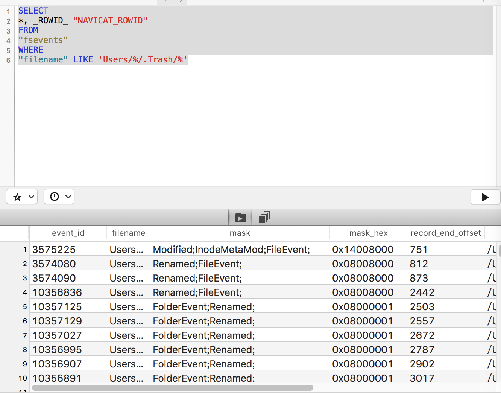
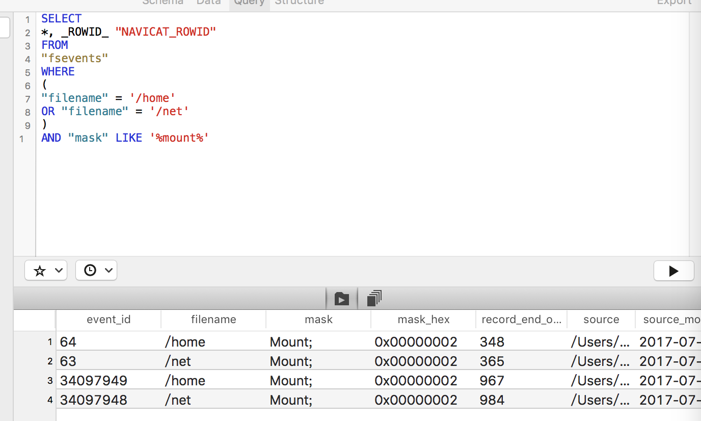
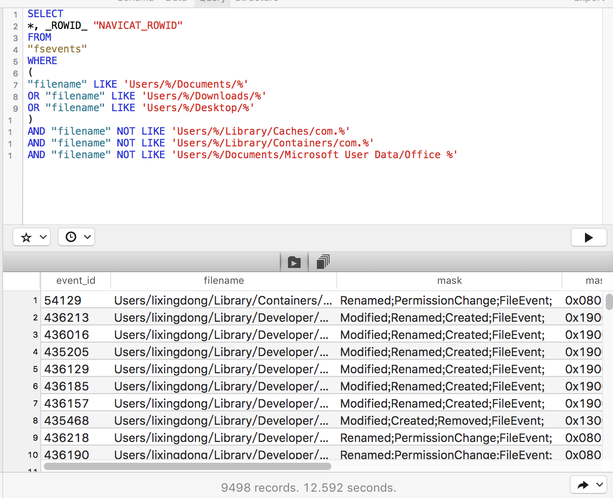
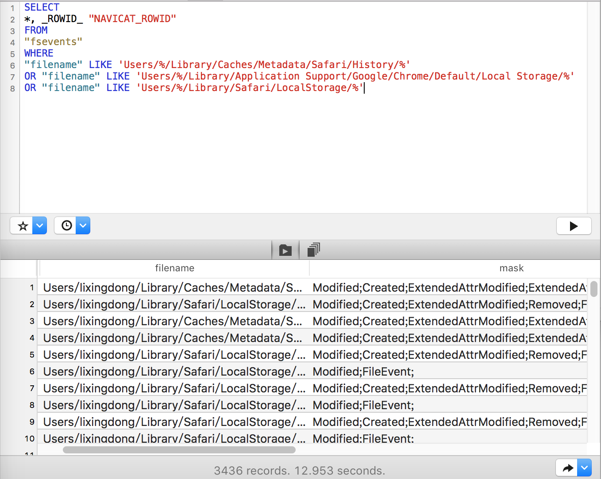

---
使用FSevents查看系统活动
---

## 废纸篓活动

```
SELECT
*, _ROWID_ "NAVICAT_ROWID"
FROM
"fsevents"
WHERE
"filename" LIKE 'Users/%/.Trash/%'
```


## 系统启动

```
SELECT
*, _ROWID_ "NAVICAT_ROWID"
FROM
"fsevents"
WHERE
(
"filename" = '/home'
OR "filename" = '/net'
)
AND "mask" LIKE '%mount%'
```


## 用户个人目录

```
SELECT
*, _ROWID_ "NAVICAT_ROWID"
FROM
"fsevents"
WHERE
(
"filename" LIKE 'Users/%/Documents/%'
OR "filename" LIKE 'Users/%/Downloads/%'
OR "filename" LIKE 'Users/%/Desktop/%'
)
AND "filename" NOT LIKE 'Users/%/Library/Caches/com.%'
AND "filename" NOT LIKE 'Users/%/Library/Containers/com.%'
AND "filename" NOT LIKE 'Users/%/Documents/Microsoft User Data/Office %'
```


## 互联网活动
```
SELECT
*, _ROWID_ "NAVICAT_ROWID"
FROM
"fsevents"
WHERE
"filename" LIKE 'Users/%/Library/Caches/Metadata/Safari/History/%'
OR "filename" LIKE 'Users/%/Library/Application Support/Google/Chrome/Default/Local Storage/%'
OR "filename" LIKE 'Users/%/Library/Safari/LocalStorage/%'
```

