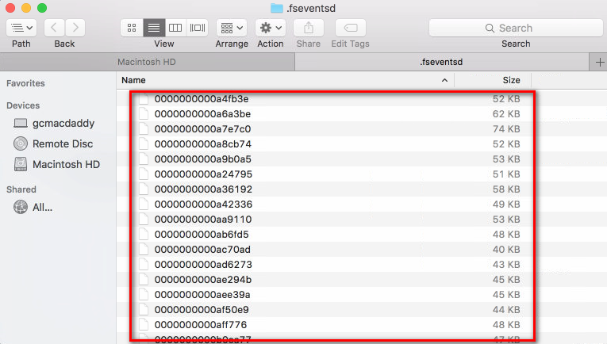
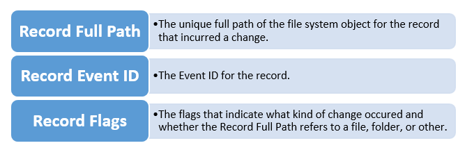
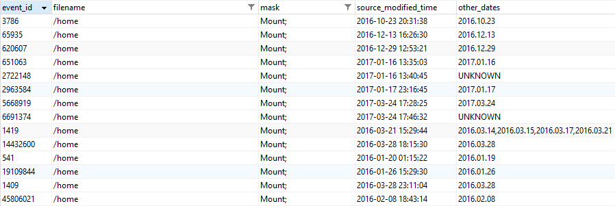

---
Apple FSEvents Forensics
---


没有相关文档、未被探索、利用不足，这就是 FSEvents 目前的状况。Apple FSEvents 或者说文件系统对于每个苹果取证人员而言都是非常宝贵的证物，它记录着文件系统发生的变化。在这篇文章中，我将对存储在磁盘中的 FSEvents 日志做简要概述，包括 FSEvents 的背景知识和行为。本文主要基于 OS X，但也涉及到 iOS。

本文讨论的主题包括：

* FSEvents 介绍
* FSEvents 位置
* FSEvents 结构
* FSEvents 行为
* 解析 FSEvents
* 有趣的事件
* 关于FSEvents 注意事项

## FSEvents 介绍
在OS X 中，FSEvents 记录了磁盘上文件系统对象（比如文件或文件夹）所发生的变化。它被TimeMachine 和 Splotlight 等操作系统的多个组件使用。

OS X 10.5和10.6仅能捕获与文件夹相关的事件， 从OS X 10.7开始引入文件事件。 类似于Windows系统的NTFS日志（该日志记录一直文件系统活动，并将数据存储在UsnJrnl:$J中），FSEvents也一直记录文件系统变化，并将数据存储在FSEvent日志文件中。

通过解析FSEvent日志，文件系统曾发生过的事件，如文件、文件夹、符号链接和硬链接的创建、删除、重命名、修改、权限更改等都可以被审计，并用于法庭取证。

其中有价值的日志包括：安装和卸载外部驱动器和磁盘映像、用户配置目录中的活动、文档编辑、互联网活动、移动到垃圾篓的文件，下载的文件等等。

## FSEvents 位置

#### 在OS X中的位置
在OS X上，FSEvent日志位于系统根目录的".fseventsd /"隐藏目录中。 请注意，默认情况下，正在运行的Mac系统需要取得相应权限才能访问此目录。


#### 在iOS中的位置
对于iOS设备，存在多个存储FSEvent日志的位置。 请注意，通常需要越狱的设备才能访问FSEvent日志。 FSEvent日志位置包括：

1）系统：/.fseventsd

2）数据：/private/var/.fseventsd

* 设备被激活使用后才被使用。

3）开发人员补丁：/DeveloperPatch/.fseventsd

* 包含用户首次使用设备之前的记录。 如果操作系统被升级，这可能还包括升级程序的活动，但尚未验证。

#### 外部设备位置
对于插入Mac的外部设备，Fsevents位于设备根目录中的".fseventsd/"。 然而，有几种情况会导致外部设备存在".fseventsd/"目录，但目录中却没有日志：

a.外部设备已插入Mac，但设备没有被安全移除，导致FSEvent日志丢失。 例如，用户从Mac中拔出usb驱动器，而不使用Finder中的卸载图标。

b.外部设备已插入Mac，设备被安全移除，但操作系统在完成将FSEvent写入磁盘之前，设备已被拔下。

c.外部设备已插入Mac，但设备使用的是Mac无法识别的文件系统。

#### FSEvent日志文件

".fseventsd/"目录可以包含一个、几个甚至数百个文件日志，其中包含了文件系统和用户几天甚至上月的历史活动日志。

单个日志文件刻录的日志数量，取决于磁盘上发生的事件数量。系统更新、升级和应用程序安装通常会生成大量的FSEvents。

日志是使用十六进制格式表示的特定命名标准命名的gzip压缩包。 每个FSEvent日志的名称引用其文件中最后一个事件的ID加1。

例如，下图中列出的FSEvent日志的第一个，当文件名从十进制值"00000000000a4b3e"转换为十进制时，该值为674,622。 因此，此文件中的最后一个事件ID为674,621，比674,622小1。



#### FSEvent记录的生命周期
FSEvent记录最初存储在内存中。当磁盘上的对象发生更改时，FSEvents API将检查对象是否被分配了使用相对完整路径命名的事件ID。FSEvent记录的内容（包括事件ID在内）将在后面进行更详细的讨论。如果内存中的对象没有被分配事件ID，则会分配一个与对象关联的事件ID，并将对象的相对完整路径、记录标志和事件ID存储在内存中。如果对象已经被分配了事件ID，API将会更新记录标志以包括当前的更改。对于内存中事件ID的每次更改，API都会将其合并存储为对象的单个事件。

当FSEvents API确定内存缓冲区已满或磁盘被卸载时，会更新磁盘上的FSEvents日志.一旦被写入磁盘，API将不会修改日志的内容。

综上所述，可以在单个FSEvent记录中记录多次更改，每条记录都表示了对象发生的更改。 例如，用户在桌面创建了一个文本文件，然后修改它，五分钟后再次修改，然后最终删除，这多次修改将会作为单个事件记录一次。 解析文本文件的事件记录如下所示：


注意，上面的FSEvent记录显示了发生了哪些更改，但更改的顺序也不在日志中。
这些限制并不是内容分析的锅，而是由于FSEvent API 在记录更改时所施加的粒度不足而导致的。

#### FSEvent日志格式
FSEvent日志是以gzip格式进行存储的。 文件解压缩后，可以使用十六进制编辑器打开文件，以查看原始字符串。


## FSEvents 结构
每条FSEvent日志包含了磁盘上一个对象的历史更改信息。 FSEvent日志中的每条记录包含三个主要组成部分：



#### Record Full Path
"Record Full Path"表示对象的相对完整路径。

#### Record Event IDs
根据苹果文档，事件ID["依次递增，即使是重新启动或驱动替换。 他们与任何特定的时钟或时基无关。"](https://developer.apple.com/reference/coreservices/fseventstreameventid)

对象在每个FSEvent文件中被分配一个事件ID。 但是它可以有多个日志文件，所以它在多个日志中具有多个事件ID。

#### Record Event Flags
事件标志存储在每个FSEvents记录中，其中包含一些位标志：

- type标志：
	* 文件、文件夹、硬链接或符号链接
- reason标志：
	* 创建、删除、修改、重命名、权限、Inode元数据、Finder信息、挂载或卸载
	* 其他reason标志包括：最后一个硬链接被删除，结束事务和文档修订

#### 查看FSEvents的十六进制文件
下面的示例是从thumb驱动器解压缩的FSEvents日志，它包含了驱动器上发生的活动。

以幻数"1SLD"开头的12个字节是FSevents日志文件的页头，一个文件可以有多个页头，只想一个对象的事件开始。

在下图中，总共有三个事件，我们只讨论第一个事件。第一个"My_File_1.txt"的记录被存储在便宜0x0C的位置。


每个对象的路径都是以"0x00"结束的。
紧随其后的是事件ID。对于我们的示例中的第一个事件，它位于偏移0x1a。 该记录的事件ID为0x01548d或十进制的87,181。
事件ID之后是记录标志，其存储在偏移量0x22位置。 本文不包含对于记录标志位的详细叙述，但是对于该事件，0x5505800的十六进制值表示这是已经被创建、修改、Finder信息被改变并且inode元数据被改变的文件。

## FSEvents 行为
在下表中涵盖了有关每个合理的标志的信息，表格中包括但不限于设置该标志的一些场景。

| 记录标志 | 名称 | 描述 | 可能的场景 |
|---------|-----|------|----------|
|0x00000001|对象是文件夹|(路径表示的)对象指向一个文件夹||
|0x00000002|挂载|一个卷被挂载|- 已连接网络驱动器或共享<br>- 已插入可移动驱动器<br> - 通过双击挂载了DMG<br>- 终端中使用了mount命令<br>- 系统启动时内部磁盘挂载|
|0x00000004|卸载|一个卷被卸载|- 已断开连接网络驱动器或共享<br>- 已卸载可移动驱动器<br> - DMG文件被卸载<br>- 终端中使用了unmount命令<br>- 系统关闭或重新启动时已挂载的卷被卸载|
|0x00000020|事务结束|已卸载卷，并指示挂载的事务结束||
|0x00000800|删除最后一个硬链接|最后一个硬链接被删除||
|0x00001000|对象是一个硬链接|(路径表示的)对象指向一个硬链接|- 使用终端命令ln|
|0x00004000|对象是个软链接|(路径表示的)对象指向一个软链接|- 使用终端命令ln -s|
|0x00008000|对象是个文件|(路径表示的)对象指向一个文件||
|0x00010000|权限更改|(路径表示的)对象的权限已更改|- 使用终端命令 chmod 或 chown<br>- 通过按住ctrl键单击一个对象并选择"Get Info"来修改所有权信息|
|0x00020000|扩展属性修改|(路径表示的)对象扩展属性已修改|- 使用终端命令xattr<br>- 在Finder中修改对象的标签<br>- 更改用于打开文件的默认应用程序|
|0x00040000|扩展属性移除|(路径表示的)对象扩展属性已移除|- 使用终端命令 xattr -d|
|0x00100000|文档修订已更改|(路径表示的)对象的文档修订已更改|- 启用修订版本的文档被更改时|
|0x01000000|创建|创建了一个文件。注意这个纪录标志只用于文件，不用于文件夹|- 将文件从一个挂载的卷复制到另一个挂载的卷<br>- 使用终端命令touch<br>- 使用文件复制和粘贴
|
|0x02000000|移除|(路径表示的)对象被移除。这个记录标志可被设置于文件或文件夹|- 从一个已挂载的卷中移动文件到另外一个卷<br>- 清空垃圾篓<br>- 使用终端命令rm|
|0x04000000|索引节点元数据修改|(路径表示的)对象索引节点元数据已修改|- 文件或文件夹被锁定或解锁|
|0x08000000|重命名|(路径表示的)对象被重命名。注意，重命名意味着对象被更改名称或它被移动到了别的文件夹下|- 重命名一个文件或文件夹<br>- 在同一个卷中移动文件或文件夹<br>- 使用终端命令 ren 重命名文件或文件夹<br>- 使用终端命令 mv 在同一个卷中移动文件或文件夹|
|0x10000000|内容修改|(路径表示的)对象内容被修改|- 编辑文件的内容 <br>- 修改用于打开文件的默认应用程序|
|0x20000000|交换|(路径表示的)对象内容与另一文件内容交换|- 文档被编辑然后保存，该文档的临时文件与正在保存的文档共享信息|
|0x40000000|Finder 信息修改|(路径表示的)对象的Finder信息被修改|- stationary pad选项已修改 <br>- Tags已更改|
|0x80000000|文件夹创建|创建了一个文件夹|- 使用终端命令mkdir<br>- 使用文件夹的粘贴和复制|

## 解析 FSEvents

可以使用付费或开源工具来解析FSEvents。

BlackBag Technologies BlackLight 2016 R1 支持解析FSEvents。

FSEventParser是由G-C Partners开发的一款免费开源的Python工具，[FSEventParser官网](https://github.com/dlcowen/FSEventsParser)。

```
用法：FSEParser_v2.1.py -c CASENAME -s SOURCEDIR -o OUTDIR

选项：*

-h，-help 显示帮助消息并退出

-c CASENAME 当前会话的名称，用于命名标准

-s SOURCEDIR 包含要解析的fsevent文件的源目录

-o OUTDIR 用于存储解析的报告的目标目录
```

一旦运行命令，解析器将提取SOURCEDIR中的每个FSEvent日志文件中的记录，将解析的数据放入一个tab符分隔的tsv文件和OUTDIR中的SQLite数据库。


#### FSEventsParser 的输出
解析器完成解析后，可以使用Excel打开tsv文件。使用对象的路径名进行排序（下面的截图中的文件名列）。 要在解析输出中实现时间顺序的排序，请按"event_id"列排序升序。 但是请记住，时间顺序仅与对象发生第一次更改的时间相关。


FSEventsParser脚本还生成一个包含解析记录的SQLite数据库，这对于大于百万级别记录的分析很有用。SQLite数据库也可用于通过查询提取感兴趣的记录。

## 有趣的事件
这里所有讨论的事件都是使用FSEventParser工具的SQLite结果。 这里列出的事件只会浅显的涉及FSEvents日志中的内容。 本节可以告诉你能从日志中找到什么。但解释如何生成这些事件的确切原因需要额外的测试和验证。

#### 垃圾篓（Trash）的活动
FSEvents日志文件记录垃圾篓活动，包括发送到垃圾篓和清空垃圾篓。 发送到垃圾篓的对象将包含"Renamed"掩码(mask)。 从"垃圾篓"中清空的文件将包含"Removed"掩码。

下图显示了发送到垃圾篓的文件和文件夹。 请注意，在"mask"列中，所有事件都包括"Renamed"。 "Renamed"的说法有点用词不当。"Renamed"掩码以两种方式分配给事件：

1. 文件的名称已更改。
2. 该文件从一个文件夹移动到另一个文件夹（仅本地移动，不能跨卷移动）。

对于垃圾篓中的文件夹，当文件发送到垃圾篓时，他们会收到一个"Renamed"掩码，因为它们已从卷上某个其他位置移动到垃圾篓。


###### SQLite查询示例
```
SELECT
*, _ROWID_ "NAVICAT_ROWID"
FROM
"fsevents"
WHERE
"filename" LIKE 'Users/%/.Trash/%'
```
#### 系统启动

系统启动时，系统将挂载"/home"和"/net"。 我们可以查询SQLite数据库以获取系统引导的时间列表。 在下图中，只查询了"/home"。



###### SQLite查询示例
```
SELECT
*, _ROWID_ "NAVICAT_ROWID"
FROM
"fsevents"
WHERE
(
"filename" = '/home'
OR "filename" = '/net'
)
AND "mask" LIKE '%mount%'
```

#### 用户个人目录
用户个人目录中的活动也可能特别令人感兴趣。这可能包括文档、下载和桌面活动。 在下面的图片中，一个目录被重命名，并在桌面上创建了两个DMG， 在下载目录中，创建了一个ZIP文件。

请注意，这些文件的一些创建是由用户发起的，有些是由应用程序或操作系统创建的。 在下载目录中，.BAH.XSEHo 、.DS_Store 和 M9hlK5RI.zip.part 不是由我直接创建和修改的。


###### SQLite查询示例
```
SELECT
*, _ROWID_ "NAVICAT_ROWID"
FROM
"fsevents"
WHERE
(
"filename" LIKE 'Users/%/Documents/%'
OR "filename" LIKE 'Users/%/Downloads/%'
OR "filename" LIKE 'Users/%/Desktop/%'
)
AND "filename" NOT LIKE 'Users/%/Library/Caches/com.%'
AND "filename" NOT LIKE 'Users/%/Library/Containers/com.%'
AND "filename" NOT LIKE 'Users/%/Documents/Microsoft User Data/Office %'
```

#### 挂载的卷

当驱动器插入时，操作系统将尝试安装它。 当双击DMG时，操作系统也将尝试安装它。 挂载也记录在FSEvents中。


###### SQLite查询示例
```
SELECT
*, _ROWID_ "NAVICAT_ROWID"
FROM
"fsevents"
WHERE
"mask" LIKE '%mount%'
AND "filename" NOT LIKE '/net'
AND "filename" NOT LIKE '/home'
```

#### 互联网活动

针对Safari和Chrome之类的网络浏览器使用URL的名字来存储互联网活动。 这些更改记录在FSEvents中。 下面图片中列出的大多数网站是我直接访问该网站的结果，其他网站没不是直接访问。


###### SQLite查询示例
```
SELECT
*, _ROWID_ "NAVICAT_ROWID"
FROM
"fsevents"
WHERE
"filename" LIKE 'Users/%/Library/Caches/Metadata/Safari/History/%'
OR "filename" LIKE 'Users/%/Library/Application Support/Google/Chrome/Default/Local Storage/%'
OR "filename" LIKE 'Users/%/Library/Safari/LocalStorage/%'
```

#### iCloud同步文件

FSEvents会记录已登陆iCloud账号的同步文件。


###### SQLite查询示例
```
SELECT
*, _ROWID_ "NAVICAT_ROWID"
FROM
"fsevents"
WHERE
"filename" LIKE '%websitedata/local%'
```
#### 邮件活动

邮件活动包括收到的项目（收件箱），发送的项目和相关的附件名称。


###### SQLite查询示例
```
SELECT
*, _ROWID_ "NAVICAT_ROWID"
FROM
"fsevents"
WHERE
"filename" LIKE 'mobile/Library/Mail/%'
```
## 关于FSEvents 注意事项

像任何取证一样，有一些必须熟悉的注意事项。 对于FSEvents，这些包括：

* FSEvents丢失
* 缺少时间戳
* 外部设备和FSEvents的短暂
* 反取证
* 合并多项变更

#### FSEvents日志丢失
有几种情况会导致FSEvents日志丢失或从卷中移除（删除）。 这可能包括：

* 系统的硬重启
* 系统崩溃
* 未正确卸载卷
* 系统升级
在OS X上，当从卷中删除FSEvents日志时，它们将会变成未分配的状态(泽者注：文件删除，只是删除了此文件与磁盘上实际存储位置之间的对应关系，文件内容并没有真正从硬盘删除)。 因此，可以使用数据恢复技术恢复FSEvents日志。

#### 缺少时间戳
FSEvents记录由三个部分组成：完整路径，记录标志和事件ID。 时间戳不是三部分之一。

有办法克服这个问题，但到目前为止，没有人能给你事件发生的精确时间戳。从苹果系统日志文件的名称中提取时间数据，并且可能会在FSEvents日志中记录其他文件的名称，以帮助确定事件发生的大致时间。
#### 外部设备
外部设备上的FSEvents可能特别不稳定。

* 当进行安全删除时，操作系统将FSEvents记录写入设备。这可以通过观察装配在一些可移动设备上的读/写指示灯来观察。在OS中启动安全删除后，指示灯将闪烁，并在完成后停止。如果在指示灯停止闪烁之前驱动器已拔下，则操作系统可能尚未完成写入，并且这些FSEvents记录可能会丢失并且无法恢复。
* 当驱动器已拔下但用户未执行安全删除时，存储在设备内存中的FSEvents将丢失，不会写入驱动器。
* 如果驱动器使用EXFAT或FAT32格式化，则使用安全删除并不总是能确保将事件写入了磁盘。确切的原因尚未确定，对于非hfs格式化的可移动设备，一直有FSEvents丢失的事件发生。

#### 合并多项变更
FSEvents记录标志可以指示文件或文件夹发生多次更改。由于FSEvents API记录和存储变化的工作原理的特性，确定每个单独变化发生的顺序以及发生这些更改的次数所需的粒度是无法满足的。

使用FSEvents我们顶多只能确定对象的第一次更改发生的时间。

首先有一个坏消息，这里存在一个很严重的问题。请记住，FSEvents使用对象的相对完整路径来存储事件。所以，比如说我在桌面上创建了一个名为"example.zip"的文件，在短时间内，该文件不论以任何方式被删除，然后再次创建具有完全相同名称和路径的另一个文件。现在我的桌面上有一个完全不同的文件， 但是 FSEvents API将它们看作是同一个文件，因为它仅在记录更改时考虑相对完整路径。所以即使"example.zip"创建了两次，是两个完全不同的文件，它只记录一次（请记住，这是在短时间内发生的）。

还有一个好消息是，FSEvents确实记录了一个文件/文件夹被更改的事实，我们知道发生了什么样的更改，只是不知道顺序和频率。
